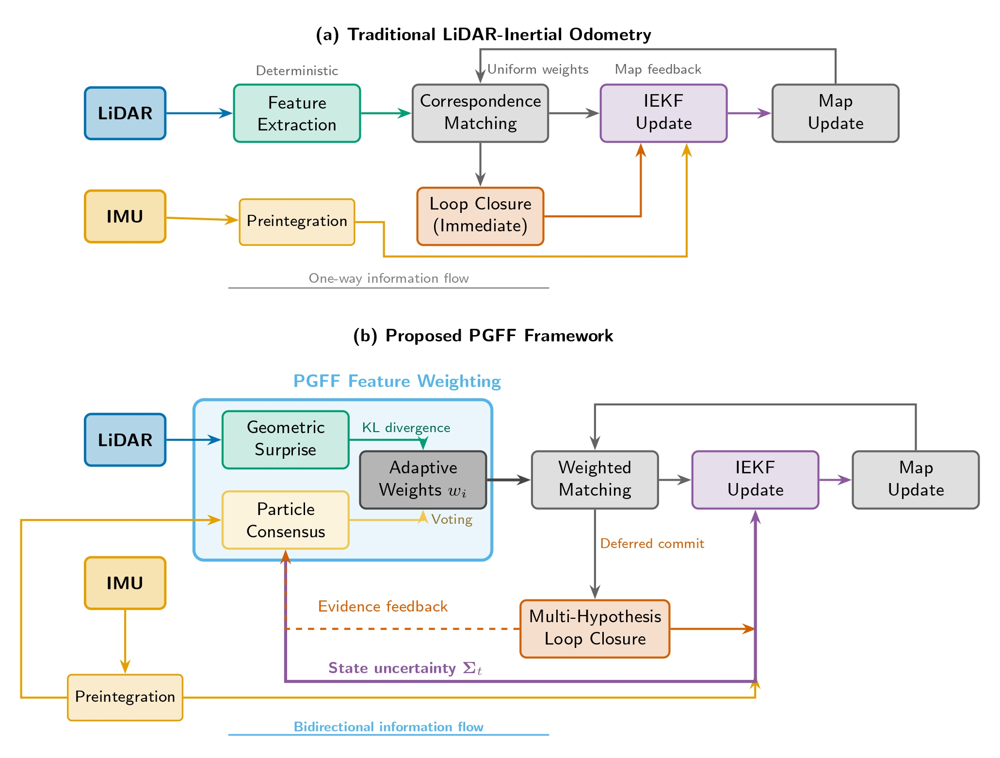
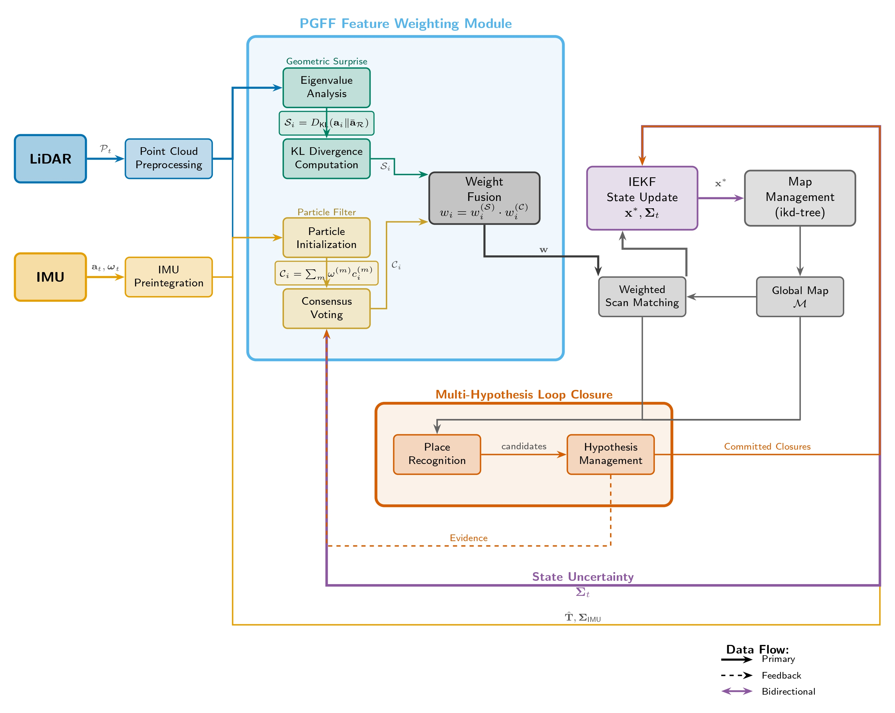

# PGFF: Particle-Guided Feature Fusion for Robust SLAM

**From Particles to Features: Uncertainty-Guided Geometric Reasoning for Robust SLAM**

---

## Quick Start

```bash
# 1. Install dependencies
bash scripts/install_dep.sh

# 2. Build
bash scripts/build_pgff.sh && source install/setup.bash

# 3. Run on example dataset
./bin/run_slam_offline --config config/pgff_vbr.yaml --bag data/VBR/campus/ros2.db3
```

**See [Getting Started](#getting-started) for detailed instructions.**

---

## Table of Contents
- [Overview](#overview)
- [Main Contributions](#main-contributions)
- [System Pipeline](#system-pipeline)
- [Getting Started](#getting-started)
  - [Prerequisites](#prerequisites)
  - [Build](#build)
  - [Running PGFF](#running-pgff)
  - [Configuration](#configuration-files)
  - [Output Files](#output-files)
  - [Visualization](#visualization)
  - [Troubleshooting](#troubleshooting)
- [Method Summary](#method-summary)
- [Experimental Results](#experimental-results)
- [Key Parameters](#key-parameters-reported-in-the-paper)
- [Limitations](#limitations)
- [Citation](#citation)

---

## Overview

Particle-Guided Feature Fusion (PGFF) is a LiDAR-inertial SLAM framework that shifts uncertainty handling from pose sampling to feature reasoning. Instead of using particles to sample robot poses, PGFF propagates particles through feature space to estimate correspondence reliability and guide geometric weighting. This creates bidirectional information flow between state estimation and feature selection. 

The paper’s central argument is that SLAM often treats state estimation probabilistically while leaving feature extraction and loop closure deterministic. PGFF addresses that asymmetry by making feature weighting uncertainty-aware.



*Figure 1.  Comparison of (a) traditional LiDAR-inertial odometry pipelines and (b) the proposed PGFF framework. Traditional approaches treat feature extraction
as deterministic preprocessing with one-way information flow.*

## Main Contributions

1. **Geometric surprise prior**
   - Computes local geometric descriptors from neighborhood eigenvalue structure.
   - Uses information-theoretic divergence to score how informative a point is relative to its local region.
   - Emphasizes corners, edges, and structural discontinuities while suppressing redundant planar regions.

2. **Particle-based adaptive weighting**
   - Uses particles to vote on correspondence reliability.
   - High consensus means a feature is reliable; disagreement means it is ambiguous or likely unreliable.
   - Final feature weights combine geometric surprise and particle consensus.

3. **Multi-hypothesis loop closure**
   - Maintains competing loop-closure hypotheses instead of committing immediately.
   - Accumulates evidence over time and commits only when the posterior ratio exceeds the decision threshold.
   - Reduces catastrophic false positives in perceptually aliased environments.

## System Pipeline



*Figure 2. System architecture of PGFF.*

```text
LiDAR + IMU
   ↓
Point Cloud Preprocessing
   ↓
PGFF Feature Weighting
   ├─ Geometric Surprise Prior
   └─ Particle Consensus Voting
   ↓
Weighted IEKF State Estimation
   ↓
Multi-Hypothesis Loop Closure
   ↓
Pose Graph Optimization
```

PGFF is integrated into a tightly coupled LiDAR-inertial odometry pipeline built on an iterated extended Kalman filter (IEKF).

---

## Getting Started

### Prerequisites

**System Requirements:**
- Ubuntu 20.04 / 22.04 (ROS2 Foxy/Humble)
- C++17 compiler (gcc 9.0+)
- 8GB+ RAM recommended

**Install Dependencies:**

```bash
# Install ROS2 (if not already installed)
# Follow: https://docs.ros.org/en/humble/Installation.html

# Install required packages
sudo apt update
sudo apt install libopencv-dev libpcl-dev pcl-tools \
                 libyaml-cpp-dev libgoogle-glog-dev libgflags-dev \
                 ros-humble-pcl-conversions libeigen3-dev

# Or use the provided script
cd lightning-lm
bash scripts/install_dep.sh
```

### Build

```bash
# Method 1: Using the provided build script
bash scripts/build_pgff.sh

# Method 2: Manual build with colcon
source /opt/ros/humble/setup.bash
colcon build --packages-select lightning \
  --cmake-args -DCMAKE_BUILD_TYPE=Release

# Source the workspace
source install/setup.bash
```

### Running PGFF

#### 1. SLAM Mode (Offline with ROS2 Bag)

Process a recorded dataset to build a map:

```bash
# VBR dataset with PGFF enabled
./bin/run_slam_offline \
  --config config/pgff_vbr.yaml \
  --bag data/VBR/campus/ros2.db3

# NCLT dataset
./bin/run_slam_offline \
  --config config/pgff_nclt.yaml \
  --bag data/NCLT/20120115.db3

# Baseline mode (PGFF disabled for comparison)
./bin/run_slam_offline \
  --config config/baseline_vbr.yaml \
  --bag data/VBR/campus/ros2.db3
```

#### 2. SLAM Mode (Online with Live Sensor)

Real-time SLAM with live LiDAR/IMU:

```bash
# Make sure ROS2 is publishing sensor data
# Topics: /ouster/points (LiDAR), /imu/data (IMU)

./bin/run_slam_online --config config/pgff_vbr.yaml
```

#### 3. Localization Mode (Pre-built Map)

Localize against an existing map:

```bash
# First, save a map from SLAM mode
# (Map saved automatically in data/maps/)

# Offline localization
./bin/run_loc_offline \
  --config config/pgff_vbr.yaml \
  --map data/maps/campus.pcd \
  --bag data/VBR/test_sequence.db3

# Online localization
./bin/run_loc_online \
  --config config/pgff_vbr.yaml \
  --map data/maps/campus.pcd
```

#### 4. Loop Closure Only Mode

Process loop closures on pre-computed odometry:

```bash
./bin/run_loop_offline \
  --config config/pgff_vbr.yaml \
  --input data/odometry.txt
```

### Configuration Files

Different configurations for various use cases:

| Config File | Description | Use Case |
|-------------|-------------|----------|
| `pgff_vbr.yaml` | PGFF enabled, VBR dataset | Main PGFF evaluation |
| `pgff_nclt.yaml` | PGFF enabled, NCLT dataset | Long-term outdoor SLAM |
| `baseline_vbr.yaml` | PGFF disabled | Baseline comparison |
| `pgff_default.yaml` | PGFF with default params | Generic LiDAR SLAM |
| `default_livox.yaml` | Standard config for Livox | Livox Mid-360 sensors |

### Key Configuration Parameters

Edit config files to tune PGFF behavior:

```yaml
fasterlio:
  enable_pgff: true          # Master switch for PGFF

  # Core PGFF parameters (typical defaults)
  # Note: These are in the C++ code, not all exposed in YAML
  # Particle count: M = 50
  # Resampling threshold: γ = 0.5
  # Consensus sharpness: β = 2.0

system:
  with_loop_closing: true    # Enable multi-hypothesis loop closure
  with_ui: true              # Enable visualization (Pangolin)
  with_2dui: false           # 2D bird's-eye view UI
```

### Output Files

After running, results are saved in:

```
lightning-lm/
├── results/
│   ├── trajectory.txt       # Estimated poses (TUM format)
│   ├── loop_closures.txt    # Detected loop closures
│   └── metrics.txt          # ATE, RPE, timing stats
├── data/maps/
│   └── <session_name>.pcd   # Saved point cloud map
└── log/
    └── pgff_runtime.log     # Detailed PGFF logs
```

**Trajectory format (TUM):**
```
# timestamp x y z qx qy qz qw
1234567890.123 1.0 2.0 0.1 0.0 0.0 0.0 1.0
...
```

### Visualization

While running with `with_ui: true`, you'll see:
- **Main window**: Real-time LiDAR scan + map overlay
- **Particle display**: Current particle distribution (if enabled)
- **Loop closure events**: Green lines connecting matched poses
- **Console output**: N_eff, surprise values, resampling events

**Keyboard controls:**
- `Space`: Pause/resume
- `S`: Save current map
- `R`: Reset mapping
- `Q`: Quit

### Troubleshooting

**Issue: `error while loading shared libraries`**
```bash
# Re-source the workspace
source install/setup.bash
```

**Issue: `No such file or directory: ros2.db3`**
```bash
# Check bag path is correct
ls data/VBR/campus/ros2.db3

# Or update config file with correct path
```

**Issue: `Segmentation fault` on startup**
```bash
# Check config file syntax
cat config/pgff_vbr.yaml

# Verify all dependencies installed
bash scripts/install_dep.sh
```

**Issue: Images not displaying in README on GitHub**
```bash
# Make sure image files exist without spaces
ls -la doc/figure1.jpg doc/figure2.jpg

# Paths should be relative: doc/figure1.jpg (not docs/)
```

---

## Method Summary

### Geometric Surprise Prior

PGFF computes local geometric properties from neighborhood covariance and eigenvalues, then compares observed feature geometry against regional expectations using KL divergence. Points whose local geometry differs from the expected neighborhood structure receive higher weights.

### Particle-Based Feature Weighting

Particles are initialized from the IMU-predicted motion uncertainty. Each particle evaluates whether a point produces a valid correspondence. Particle consensus is then used to estimate feature reliability. The paper uses adaptive resampling based on effective sample size to preserve particle diversity when uncertainty grows.

The final feature weight is a product of the geometric surprise term and the consensus term.

### Multi-Hypothesis Loop Closure

Instead of accepting a loop closure as soon as a similarity score is high, PGFF keeps multiple hypotheses alive. Evidence is accumulated over time with Bayesian updates, and only the dominant hypothesis is eventually committed. This helps avoid wrong closures in symmetric or repetitive scenes.

## Experimental Results

The paper evaluates PGFF on the **VBR** dataset and the **NCLT** benchmark. These datasets include dynamic objects, geometric degeneracy, and perceptual aliasing.

Reported results include:

- **23.5% lower ATE** compared to **FAST-LIO2**
- **29.8% lower ATE** compared to **LIO-SAM**
- **10.1% faster IEKF convergence**
- **0.7% total runtime overhead**
- **58% fewer false positives** in loop closure
- **94% recall** for loop closure

The paper also reports improved uncertainty calibration and shows that PGFF is especially beneficial in geometrically degenerate corridor-like environments.

## Key Parameters Reported in the Paper

- Neighborhood size: `k = 20`
- Base particle count: `M = 50`
- Consensus sharpness: `β = 2.0`
- Resampling threshold: `γ = 0.5`
- Loop-closure rejection threshold: `τreject = 0.01`
- Maximum hypotheses: `Hmax = 20`

## Limitations

The paper explicitly notes that PGFF cannot create information where none exists. In extremely degenerate environments with no distinguishing geometry, all features can receive low weights and drift may still occur. The current implementation also assumes static environments and does not explicitly model dynamic objects beyond conservative reweighting.

## Summary

PGFF reframes SLAM as a bidirectional process: state uncertainty influences which features are trusted, and reliable features improve state estimation. Its main contribution is not just a new filter, but a tighter link between perception and estimation.

## Citation

If you reference this project, cite:

**From Particles to Features: Uncertainty-Guided Geometric Reasoning for Robust SLAM**